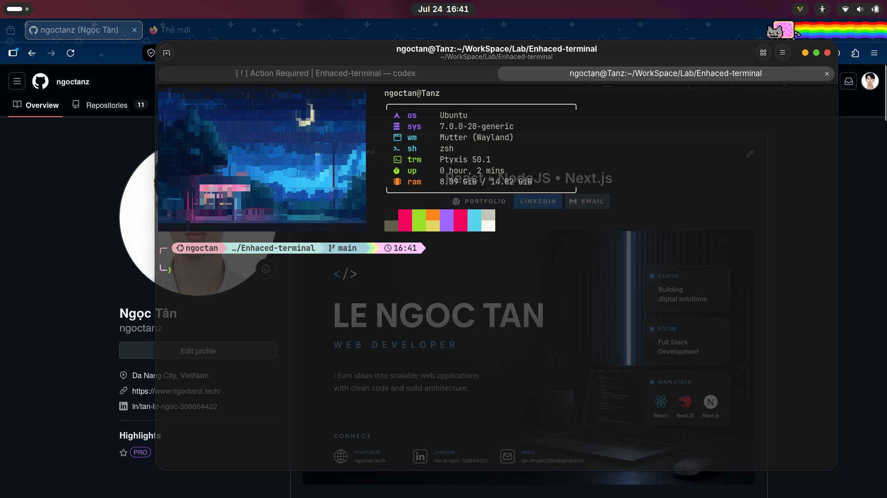

# Enhanced Linux Terminal

Turn a fresh Ubuntu/Debian or Fedora/RHEL-family terminal into a practical,
readable, and customizable developer environment without configuring every tool
by hand.




## What this project does

`install.sh` is an interactive setup script with two package backends:

1. Ubuntu/Debian (`apt` and `dpkg`)
2. Fedora/RHEL family (`dnf` and RPM)

The script detects the current system and uses it as the wizard default. You can
still select the family in the wizard or pass `--distro ubuntu` or
`--distro fedora`. Everything else is optional and defaults to **No**.

It can configure:

| Component | Purpose |
| --- | --- |
| **Ptyxis** | Change the opacity of an existing Ptyxis profile |
| **Kitty** | Install an alternative terminal emulator |
| **Zsh + Oh My Zsh** | Replace the basic interactive shell experience |
| **Starship** | Add the styled prompt included in this repository |
| **Fastfetch** | Show system information with a bundled image |
| **JetBrainsMono Nerd Font** | Render prompt and Fastfetch icons correctly |
| **Zsh plugins** | Add command suggestions and syntax highlighting |
| **Fcitx5 + Unikey** | Provide Vietnamese input support |
| **Flatpak + Flathub** | Optionally install Flatpak applications |

The script also exposes optional system update, GNOME Software, and cleanup
actions. Snap removal is offered only on Ubuntu and is never run on Fedora/RHEL.
These actions are not enabled by default.

## Terminal support

The script works whether Ptyxis, GNOME Terminal, GNOME Console, Kitty, or another
emulator is your default. Only the Ptyxis opacity option specifically requires
Ptyxis and its GSettings profile.

This project does **not** replace the default terminal automatically:

- Choosing Ptyxis only changes its opacity.
- Choosing Kitty installs Kitty but leaves the default-terminal decision to you.
- Choosing “Do nothing” leaves the current terminal untouched.

## Why customize it?

The default terminal is already stable and sufficient for normal shell
work. This setup is useful when you want:

- a prompt that shows the current directory, Git branch, language runtime, and
  time without remembering extra commands;
- command suggestions and syntax highlighting while typing;
- consistent Nerd Font icons;
- a quick system overview when opening Zsh;
- a transparent Ptyxis profile or Kitty as an alternative emulator;
- the same setup across Ubuntu/Debian and Fedora/RHEL-family machines.

This is a convenience setup, not a performance requirement. If the stock
terminal already fits your workflow, keep it.

## Pros and trade-offs

### Advantages

- Interactive and opt-in: skip anything you do not need.
- Reuses native DEB or RPM packages where available.
- Skips packages that are already installed.
- Includes matching Starship, Fastfetch, font, and image configuration.
- Supports `--dry-run` before changing the machine.
- Records newly installed items for a managed rollback.

### Trade-offs

- More shell startup output and slightly more startup work.
- Nerd Font symbols may render as squares until the terminal font is selected.
- Oh My Zsh and Starship installers are downloaded from their upstream sites.
- Package availability varies between distro releases and enabled repositories.
- Removing Snap, running a system upgrade, autoremove, or cache cleanup cannot be
  fully reversed.
- Kitty is installed as an alternative; it is not automatically made default.

## Requirements

- Ubuntu/Debian with `apt`, or Fedora/RHEL family with `dnf`
- A traditional package-managed installation (Fedora Atomic variants are not supported)
- A normal user account with `sudo` access
- An internet connection
- Bash 4 or later
- A GNOME desktop session for Ptyxis opacity changes

Do not run the whole script with `sudo`. The script requests elevated access
only for system operations.

## Quick start

```bash
git clone https://github.com/ngoctanz/perf-ptyxis-ubuntu.git perf-linux-terminal
cd perf-linux-terminal
chmod +x install.sh
./install.sh
```

Running without options opens the wizard. Review all selected actions before
the final confirmation.

For a non-interactive command, select the package family explicitly when needed:

```bash
./install.sh --distro ubuntu --dry-run --desktop-stack
./install.sh --distro fedora --dry-run --desktop-stack
```

## Preview first

Use a dry run to inspect commands without applying the selected changes:

```bash
./install.sh --dry-run --full
```

`--dry-run` still performs read-only system checks and creates a log file in
your home directory.

## Common setups

Install the recommended terminal appearance stack:

```bash
./install.sh --desktop-stack
```

This installs JetBrainsMono Nerd Font, Fastfetch, Zsh, Oh My Zsh, the Zsh
plugins, and Starship.

Install the desktop stack plus Kitty:

```bash
./install.sh --full
```

Configure only Ptyxis transparency:

```bash
./install.sh --ptyxis-opacity 0.75
```

Accepted opacity values are from `0.20` to `1.00`. Lower values are more
transparent.

Reset Ptyxis opacity:

```bash
./install.sh --reset-ptyxis-opacity
```

Install only Kitty:

```bash
./install.sh --install-kitty
```

Show every available option:

```bash
./install.sh --help
```

## Fastfetch customization

The bundled Fastfetch files are:

```text
fastfetch/
├── config.jsonc
└── assets/
    └── bg_terminal.png
```

Install the bundled configuration and image:

```bash
./install.sh --install-fastfetch
```

Use another image:

```bash
./install.sh \
  --install-fastfetch \
  --fastfetch-image /absolute/path/to/image.png
```

The installer copies the image into the active XDG configuration directory and
writes the resulting path into `config.jsonc`. The top-level `assets/`
directory contains README screenshots only.

Fastfetch uses Chafa to render the image. Every non-Ubuntu system, including
Fedora/RHEL and Debian derivatives, installs only `fastfetch` and `chafa`.
ImageMagick is retained only when `/etc/os-release` identifies Ubuntu itself.

The Fedora/RHEL wizard does not offer Snap removal because Fedora GNOME does not
use Snap by default. Passing `--remove-snap` with the Fedora backend is also a
safe no-op.

## Make Kitty the preferred terminal

The script installs Kitty but does not replace the desktop's preferred terminal.
Default-terminal handling varies by distro and desktop release, so change it
through your desktop settings or keyboard-shortcut configuration.

## GRUB paths

This project does not currently edit GRUB. If a future option needs to do so, it
must use the correct command for the selected distro family:

| Family | Editable defaults | Generated configuration | Refresh command |
| --- | --- | --- | --- |
| Ubuntu/Debian | `/etc/default/grub` | `/boot/grub/grub.cfg` | `sudo update-grub` |
| Fedora/RHEL | `/etc/default/grub` | `/boot/grub2/grub.cfg` | `sudo grub2-mkconfig -o /boot/grub2/grub.cfg` |

On Fedora, prefer `grubby` for persistent kernel-argument changes. Do not write
directly to the small UEFI forwarding file under `/boot/efi/EFI/fedora/` on
current installations.

## Rollback

Preview rollback first:

```bash
./install.sh --uninstall --dry-run
```

Then run it:

```bash
./install.sh --uninstall
```

Rollback restores recorded Fastfetch, Starship, Zsh, previous login shell, and
Ptyxis settings. It removes files and RPM packages recorded as newly installed
by this script, including the Fcitx5 autostart package when applicable.

> [!CAUTION]
> Run uninstall with the same `XDG_CONFIG_HOME` value used during installation.
> The current release recalculates config paths during rollback. Changing that
> value can target the wrong Fastfetch or Starship directory. This is tracked in
> [issue #1](https://github.com/ngoctanz/perf-ptyxis-ubuntu/issues/1).

The following actions cannot be reliably reversed:

- a system update or upgrade;
- deleted Snap applications and Snap data;
- `apt autoremove` or `dnf autoremove`;
- package and journal cache cleanup;
- Flatpak unused-runtime cleanup.

## Troubleshooting

### Icons appear as squares

Log out and back in, then select **JetBrainsMono Nerd Font** in the active
terminal profile.

### Zsh is installed but Bash still opens

Log out and back in after installation. Check the configured shell with:

```bash
getent passwd "$USER" | cut -d: -f7
```

### Fastfetch does not display the image

Confirm that Chafa and the copied image exist:

```bash
command -v chafa
find "${XDG_CONFIG_HOME:-$HOME/.config}/fastfetch" -maxdepth 2 -type f
```

### Ptyxis opacity is skipped

The command requires Ptyxis, its GSettings schema, a valid profile, and an
active desktop session. Open Ptyxis once to create a profile, then retry:

```bash
./install.sh --ptyxis-opacity 0.75
```

### Fcitx5 starts but Unikey is not available

Log out and back in after installation, then add Unikey to the active input
methods. On Fedora use `fcitx5-configtool`; the Fedora branch installs
`fcitx5-autostart`. The Ubuntu branch uses `im-config`.

### A package is reported as unavailable

Refresh package metadata and retry:

```bash
# Ubuntu/Debian
sudo apt update

# Fedora/RHEL
sudo dnf makecache --refresh
```

Some packages are not available on every distro release or enabled repository.

## Project layout

```text
.
├── install.sh
├── configs/
│   └── starship.toml
├── fastfetch/
│   ├── config.jsonc
│   └── assets/
│       └── bg_terminal.png
└── assets/
    ├── terminal_fastfetch.png
    └── fullscrenn.png
```

## Security notes

Read `install.sh` and use `--dry-run` before installation. The shell stack
downloads the official Oh My Zsh and Starship install scripts over HTTPS, but
the current project does not pin their versions or verify release checksums.

Never run shell installers from forks or modified copies you do not trust.

## Contributing

Bug reports and focused pull requests are welcome. Include:

- distro and version;
- desktop environment;
- the exact command used;
- the relevant `enhanced-terminal-*.log` output;
- whether the failure also occurs with `--dry-run`.
