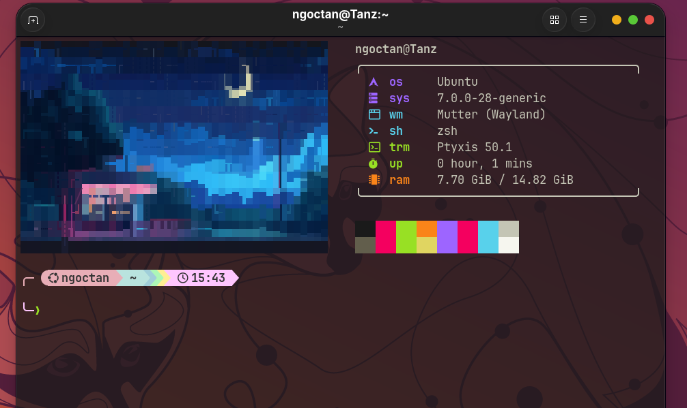

# Enhanced Ubuntu Terminal



An interactive Ubuntu setup script for Zsh, Oh My Zsh, Starship, Fastfetch,
JetBrainsMono Nerd Font, Kitty, Ptyxis opacity, Fcitx5, Flatpak, and optional
system cleanup.

## Run

With no options, the script opens a wizard. Every choice defaults to **No**.

```bash
chmod +x install.sh
./install.sh
```

Preview a non-interactive setup:

```bash
./install.sh --dry-run --full
./install.sh --full
```

Useful choices:

```bash
./install.sh --desktop-stack
./install.sh --install-fastfetch
./install.sh --install-fastfetch --fastfetch-image /path/to/image.png
./install.sh --ptyxis-opacity 0.75
./install.sh --install-kitty
./install.sh --uninstall
```

Run `./install.sh --help` for every option.

## Fastfetch

The default files are:

- `fastfetch/config.jsonc`
- `fastfetch/assets/bg_terminal.png`

The installer copies them into the active XDG config directory, writes the
correct absolute image path, and backs up the previous Fastfetch directory.
The top-level `assets/` directory only contains GitHub preview images.

## Rollback

`--uninstall` restores backed-up configs, the previous shell and Ptyxis
opacity, then removes packages and files recorded as newly installed by this
script.

System upgrades, deleted Snap data, autoremove, and cleaned caches cannot be
reliably reversed. The script warns before those actions.
